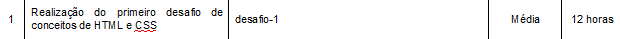
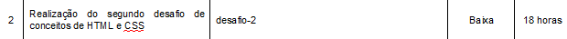
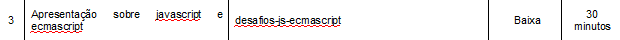
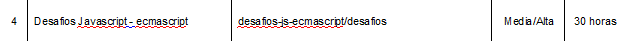
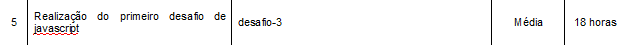
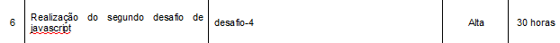
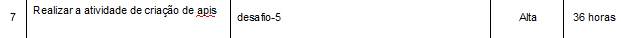

  <h1>Treinamento WEB</h1>

  
Olá, boas vindas ao nosso treinamento

  
   
  
  
Nesse README voce encontrará algumas informações sobre o cronograma com sugestões para a ordem de realização das atividades

  
e também um arquivo com o msmo cronograma mais detalhado

  
   
  
  
Em cada pasta você encontrará um README como esse com informações sobre a atividade

  
Quaisquer dúvidas fique a vontade para perguntar a qualquer um da equipe, e tamb´m para sugerir ideias
 

 

<h4>A seguinte ordem de estudo é sugerida</h4>

<h5>HTML - CSS</h5>

 
<h5>JS</h5>

 
<h5>HTML - CSS - JS</h5>

 
<h5>JAVA - SPRING</h5>

