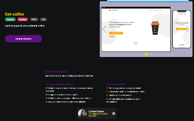
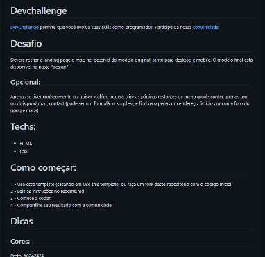

HTML / CSS  - Challenge 1

você irá acessar o seguinte desafio pelo site do DevChallenge 
https://www.devchallenge.com.br/challenges/5f94dfc04b6510002196cb1d/details

e irá logar com sua conta do github no site, e então apertar o botão de iniciar o desafio para ser encaminhado para a pagina do projeto no github, que contém um Readme com os detalhes do projeto, imagens a serem usadas e o protótipo no figma

Você então dará um fork nesse repositório e realizará o desafio

dica: https://css-tricks.com/snippets/css/a-guide-to-flexbox/

OBS: nesse primeiro momento o desafio é somente de html e css, não sendo necessário uso de javascript, somente a tela estática ,porém responsiva, já cumprem o desafio
