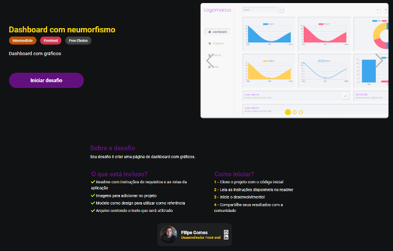
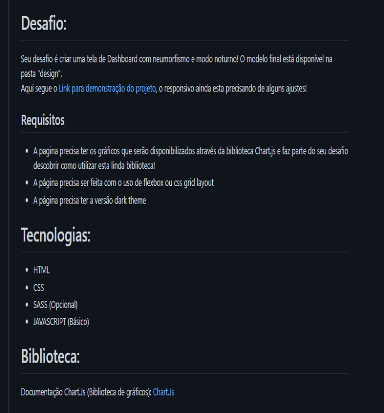

 Javascript  - Challenge 2

você irá acessar o seguinte desafio pelo site do DevChallenge 

https://www.devchallenge.com.br/challenges/6053e47eccbc5900217fecf0/details

e irá logar com sua conta do github no site, e então apertar o botão de iniciar o desafio para ser encaminhado para a pagina do projeto no github, que contém um Readme com os detalhes do projeto

Você então dará um fork nesse repositório e realizará o desafio
