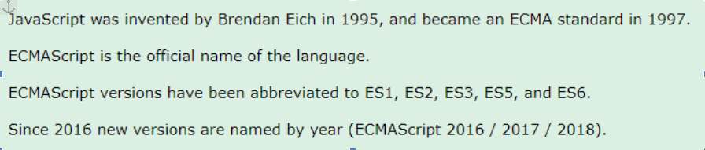
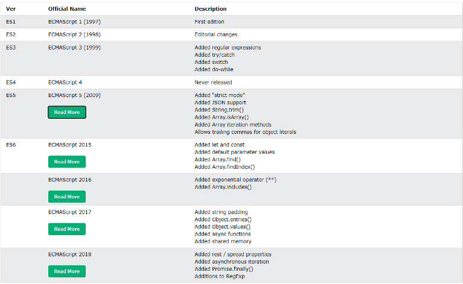

Você provavelmente já usou o javascript, mas você conhece a ECMAscript?

Com um pouco de pesquisa você consegue se deparar com a história da criação do JS que ganhou este nome devido a popularidade que a linguagem JAVA estava ganhando na época, e tentaram surfar um pouco na onda do java, entretanto não tem NADA A VER com JAVA.

	Beleza, agora e a ECMAscript? Existe uma “entidade” que ficou conhecida como ECMA, onde as principais organizações de tecnologia se juntavam e decidiam alguns padões internacionais,
e então foram definidos algumas regras e padrões para o uso do javascript em navegadores, de uma forma que todos os navegadores se adequariam a esses padrões, e desde o primeiro lançamento o nome oficial acabou ficando como ECMAscript, como é possível ver na seguinte imagem.

Tá, beleza ! Mas e o que isso importa? Bom, para entender o poder total do javascript e seus frameworks de forntend, é muito importante entender isso, já que desde 2015 com  o lançamento da ES6 ( ECMAscript 2015 ) a cada ano o javascript vem mudando drásticamente, e tendo cada vez mais funcionalidades para nos ajudar.  Quando tiver um tempo, pesquise um pouco sobre as principais funcionalidades novas que o js ganhou a cada nova atualização.